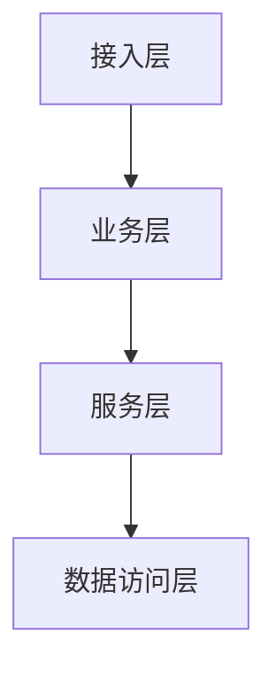

# doc.md 标准骨架模板

> **[强制]** 使用本 skill 生成的 doc.md 必须严格按此模板填写，不得自由发挥章节结构。
> 每个章节对应最终 spec 文件的相同章节，doc.md 是 spec 的草稿，结构必须完全对齐。
> **本文件同时作为内容生成指南和检查清单的唯一真相源**。workflow.md 不再重复本文件中的检查项和章节生成指南。

---

## 使用说明

- `[必填]` 标记：doc.md 中该内容必须有实质性草稿内容，不得留空
- `[可选]` 标记：不涉及时写 `N/A: [原因]`，不得删除章节
- `【约束检查】` 标记：生成该节内容前必须读取对应规范文件并通过检查项
- `> **生成提示**` 标记：章节填写时的重点指导，确保内容质量

---

# 开发 Spec 草稿：{需求标题}

> 需求文档：{文档链接}
> 迭代版本：{版本号，如 v1.0}
> 需求日期：{日期}
> 负责人：{负责人}

---

## 1. 需求背景 & 目标收益 [必填]

> **生成提示**：填写 MRD 地址、iCafe 卡片地址、需求负责人；区分业务目标（如 CVR/ROI 提升）和技术目标（如平响 < 200ms）。

| 产品需求 MRD 地址 | {填写链接或 N/A} |
|---|---|
| iCafe 卡片地址 | {填写链接或 N/A} |
| 产品需求负责人 | {填写姓名} |
| 需求背景 | {一段话说清楚为什么要做这件事} |
| 目标收益 | {业务目标（如 CVR 提升）+ 技术目标（如平响 < 200ms）} |

---

## 2. 名词解释 [可选]

> **生成提示**：表格形式列出，统一全文术语。

| 名词 | Term | 实体 ID | 含义 |
|---|---|---|---|
| {示例：Copilot} | {Copilot} | {-} | {AI 辅助推荐能力模块} |

---

## 3. 设计目标 & 思路 [必填]

### 3.1 实现的功能

> **生成提示**：分层次、分条目列出功能点及子功能点。

1. **模块 A**
   - 功能点 1：...
   - 功能点 2：...
2. **模块 B**
   - ...

### 3.2 系统目标

#### 3.2.1 业务目标

{描述业务目标，如采纳率、DAU 等指标}

#### 3.2.2 技术目标

{描述技术目标：响应时间、可用性、CPU 峰值、内存分配等}

---

## 4. 设计原则 [可选]

{列出本方案遵循的核心原则，示例：}

- **效率优先**：...
- **可靠性**：...
- **可扩展性**：...
- **可测性**：...

---

## 5. 系统环境 [可选]

### 5.1 模块依赖

> **生成提示**：表格列出依赖服务及其交互方式，附 Mermaid 依赖图。

| 依赖服务 | 功能点 | 依赖方式 | QPS/稳定性要求 | 负责人 |
|---|---|---|---|---|
| {服务名} | {依赖功能} | {HTTP/RPC/MQ} | {QPS} | {负责人} |


---

## 6. 模块设计 [必填]

### 6.1 模块架构及说明 [必填]

> **生成提示**：将 Step 2 代码探索结论写入"当前逻辑"部分；绘制 Mermaid 架构图，标注层间依赖方向。

{描述整体架构，分层说明各层职责}

**当前逻辑（代码探索结论）**

位于 `{文件路径}` 的 `{函数名}()` 方法：

```go
// 当前实现的关键代码片段（来自 Step 2 代码探索）
```

**变更说明**：
- {变更描述 1，结合具体字段/方法名}
- {变更描述 2}

**架构图**：



---

### 6.2 数据结构及说明 [必填]

> 【约束检查】生成本节前必须读取 `references/database-design-standard.md` 和 `references/cache-design-standard.md`

#### 6.2.1 数据库设计

**DDL 强制检查项（每张表必须满足，生成前逐项核对）**：
- [ ] 前 7 个字段按序为：`id` / `create_user` / `create_time` / `update_user` / `update_time` / `version` / `is_del`
- [ ] 每个字段有 `COMMENT`
- [ ] `ENGINE=InnoDB DEFAULT CHARSET=utf8mb4`
- [ ] 业务字段在第 7 个字段之后，按"关键属性 → 主要属性 → 扩展属性 → 附加属性"分组
- [ ] 预留 `ctrl_json`（varchar(512)）和 `ext_json`（varchar(2048)）扩展字段

```sql
CREATE TABLE `{表名}` (
    `id`          bigint(20) unsigned NOT NULL AUTO_INCREMENT COMMENT '主键',
    `create_user` varchar(64)  NOT NULL DEFAULT ''    COMMENT '创建记录调用方标识',
    `create_time` datetime     NOT NULL DEFAULT CURRENT_TIMESTAMP COMMENT '创建记录时间',
    `update_user` varchar(64)  NOT NULL DEFAULT ''    COMMENT '更新记录调用方标识',
    `update_time` datetime     NOT NULL DEFAULT CURRENT_TIMESTAMP ON UPDATE CURRENT_TIMESTAMP COMMENT '更新记录时间',
    `version`     int unsigned NOT NULL DEFAULT 0     COMMENT '乐观锁标记',
    `is_del`      tinyint unsigned NOT NULL DEFAULT 0 COMMENT '逻辑删除，0未删除，1已删除',
    -- 关键属性
    `{业务主键字段}` varchar(64) NOT NULL DEFAULT '' COMMENT '{说明}',
    -- 主要属性
    `{核心业务字段}` {类型} NOT NULL DEFAULT {默认值} COMMENT '{说明}',
    -- 扩展属性
    `ctrl_json`   varchar(512)  NOT NULL DEFAULT ''   COMMENT '控制字段',
    `ext_json`    varchar(2048) NOT NULL DEFAULT ''   COMMENT '扩展字段',
    PRIMARY KEY (`id`),
    UNIQUE KEY `uk_{业务主键}` (`{业务主键字段}`),
    KEY `idx_{查询字段}` (`{查询字段}`)
) ENGINE=InnoDB DEFAULT CHARSET=utf8mb4 COMMENT='{表注释}';
```

**数据量评估**：

| 评估项 | 估算值 |
|---|---|
| 初始数据量 | {上线时预估行数} |
| 日增速度 | {每日新增行数} |
| 1 年数据量 | {估算} |
| 3 年数据量 | {估算，是否需要分表} |
| 单行平均大小 | {估算 bytes} |
| 是否需要分表 | {是/否，超过 500w 行建议评估} |

**核心查询 SQL 及索引设计**：

```sql
-- 查询 1：{说明}
SELECT {字段列表} FROM {表名}
WHERE {条件}
LIMIT 1;
-- EXPLAIN 预计：type=ref, key={索引名}, rows={预估行数}
```

> **生成提示**：索引数量不超过 5 个；完整 DDL 建表语句参照 `database-design-standard.md` §1.5 示例格式；数据量评估按 `database-design-standard.md` §5 评估项逐一填写。

#### 6.2.2 缓存设计（涉及 Redis 时必填，否则写 N/A）

**缓存强制检查项（生成前逐项核对）**：
- [ ] 所有 Key 必须设置 TTL，严禁无过期时间的 Key
- [ ] Key 命名遵循 `{业务系统前缀}:{模块}:{业务含义}:{标识ID}` 格式
- [ ] 每个 Key 说明数据结构类型并给出选型理由
- [ ] 明确缓存一致性策略（推荐：先更新 DB，再删除缓存）
- [ ] 说明穿透/击穿/雪崩三大问题的应对方案

**Key 设计表格**：

| Key 名称 | 数据结构 | TTL | 选型理由 | 说明 |
|---|---|---|---|---|
| `{前缀}:{模块}:{含义}:{id}` | String/Hash/List/Set/ZSet | {N 分钟/小时} | {理由} | {用途说明} |

**缓存一致性策略**：{先更新 DB，再删除缓存 / 其他方案及理由}

**三大问题应对**：
- **穿透**：{方案，如缓存空值/布隆过滤器}
- **击穿**：{方案，如分布式锁}
- **雪崩**：{方案，如 TTL 加随机偏移}

---

### 6.3 关键技术点 [可选]

> **生成提示**：重点覆盖以下方面（不适用的写 N/A）：远程调用配置（超时/重试策略）、并发方案设计、特殊技术选型说明及选型理由。

{远程调用配置（超时/重试）、并发方案、特殊技术选型说明}

---

### 6.4 接口设计 [必填]

> 【约束检查】生成本节前必须读取 `references/api-design-standard.md`

**接口强制检查项（每个接口必须满足，生成前逐项核对）**：
- [ ] 接口名称包含中文，清晰体现功能
- [ ] 明确标注请求方法（GET/POST/PUT/PATCH/DELETE）
- [ ] 路径只含字母、数字、中划线、下划线、点、花括号，无重复斜杠
- [ ] 每个请求参数标注：位置（Path/Query/Header/Body）、类型、是否必填、示例值
- [ ] 枚举类型穷举所有枚举值
- [ ] 响应使用统一格式（`code` / `message` / `data`）
- [ ] 定义错误码表格（错误码/错误信息/触发场景/处理建议）
- [ ] 明确鉴权方式；核心操作接口必须有鉴权控制
- [ ] 说明幂等性

**接口 1：{接口中文名}**

- **方法**：`{GET/POST/...}`
- **路径**：`{/module/resource}`
- **描述**：{用途说明，含幂等性说明}
- **鉴权**：{鉴权方式，如 UUAP Token / UGate}

请求参数：

| 参数名 | 位置 | 类型 | 必填 | 示例值 | 说明 |
|---|---|---|---|---|---|
| {param} | Body/Query/Header | String | 是/否 | {示例} | {说明} |

响应格式：

```json
{
  "code": "200",
  "message": "请求成功",
  "data": {
    "{字段}": "{示例值}"
  }
}
```

错误码：

| 错误码 | 错误信息 | 触发场景 | 处理建议 |
|---|---|---|---|
| 400 | 参数错误 | 必填参数缺失或格式错误 | 检查参数格式和必填项 |
| 401 | 未授权 | Token 无效或过期 | 重新鉴权 |
| 500 | 服务器错误 | 内部异常 | 联系服务端排查 |

---

### 6.5 非功能性需求设计 [必填]

#### 6.5.1 安全设计

> **生成提示**：逐项评估，不可跳过。重点关注越权风险、SQL 注入防护、XSS/CSRF 防护、敏感信息明文风险、隐私数据合规（数据收集/传输/存储/应用各环节）。

- **越权风险**：{评估}
- **SQL 注入**：{是否使用参数化查询}
- **XSS/CSRF**：{防护措施}
- **敏感信息**：{是否有明文存储/传输风险}
- **隐私数据自查**：{数据收集/传输/存储/应用各环节}

#### 6.5.2 性能/运维相关设计

> **生成提示**：明确监控指标名称和告警阈值；日志区分业务日志和系统日志；降级方案需说明触发条件和恢复策略。

- **性能损失评估**：{预估 QPS、响应时间}
- **监控指标**：{关键指标和告警阈值}
- **降级方案**：{熔断/降级策略，含触发条件和恢复策略}
- **日志规范**：{结构化日志，区分业务日志和系统日志}

---

## 7. 统计方案 [可选]

> **生成提示**：打点方案、埋点字段定义。不涉及写 `N/A: 无统计需求`。

| 模块 | 事件名 | 触发时机 | 核心参数 | 业务价值 |
|---|---|---|---|---|

---

## 8. 上线及回滚方案 [必填]

> **生成提示**：每步回滚操作必须 100% 可回滚；数据有损时必须有修复方案。

1. **上线顺序**：{服务上线顺序，如：数据层 → 服务层 → 接入层}
2. **小流量策略**：{流量大小、关键指标、扩量节奏}
3. **上线前 checklist**：{SQL 变更、外部依赖、资源依赖、监控确认}
4. **回滚方案**：{每个步骤的回滚操作，必须 100% 可回滚}
5. **数据有损修复**：{如有数据风险，如何修复}

---

## 9. 风险评估 [必填]

> **生成提示**：同时覆盖技术风险和业务风险，每项风险必须有应对措施。

| # | 风险描述 | 风险类型 | 应对措施 | 负责人 |
|---|---|---|---|---|
| 1 | {风险} | 技术/业务 | {措施} | {负责人} |

---

## 质量检查清单（doc.md 完成后逐项核对）

> **本清单是所有检查项的唯一定义位置**。生成 doc.md 后，逐项填写 ✅（通过）/ ❌（不合格，需修改）/ N/A（不涉及）。
> 不合格项（❌）必须在 doc.md 中修复后才能提交用户确认。

**结构完整性**
- [ ] 所有必填章节（§1/§3/§6/§8/§9）均有实质性内容
- [ ] 可选章节不适用时已写明 N/A 原因

**数据库规范**
- [ ] DDL 前 7 字段顺序和类型正确
- [ ] 所有字段有 COMMENT
- [ ] ENGINE=InnoDB, CHARSET=utf8mb4
- [ ] 有数据量评估
- [ ] 索引数量不超过 5 个

**缓存规范**
- [ ] 所有 Key 设置了 TTL
- [ ] Key 命名符合 `{前缀}:{模块}:{含义}:{id}` 格式
- [ ] 穿透/击穿/雪崩均有应对方案

**接口规范**
- [ ] 每个接口有统一响应格式（code/message/data）
- [ ] 每个接口有鉴权说明
- [ ] 每个接口有错误码表格
- [ ] 每个接口说明了幂等性

**安全与质量**
- [ ] 安全评估完成（越权/SQL 注入/XSS/CSRF/敏感信息/隐私数据）
- [ ] 代码块标注了文件路径
- [ ] 无模糊描述（精确到函数名/字段名）
- [ ] 上线回滚方案每步均可执行
- [ ] 项目级规约全部被遵守（若已加载）
